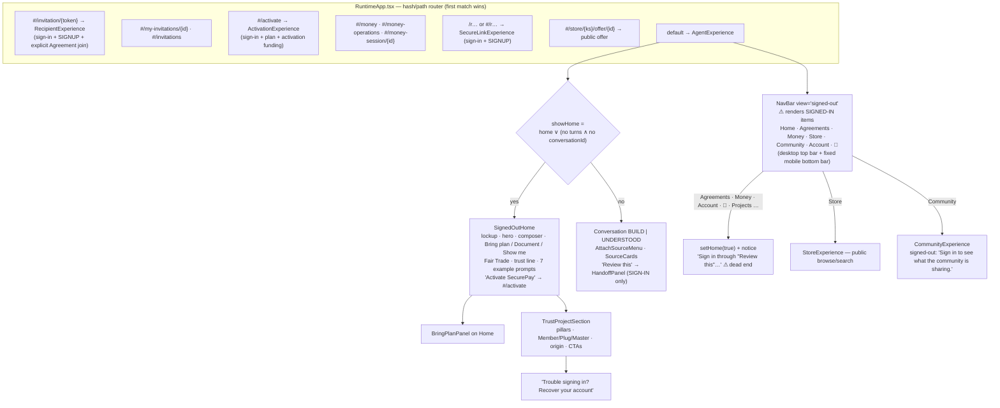
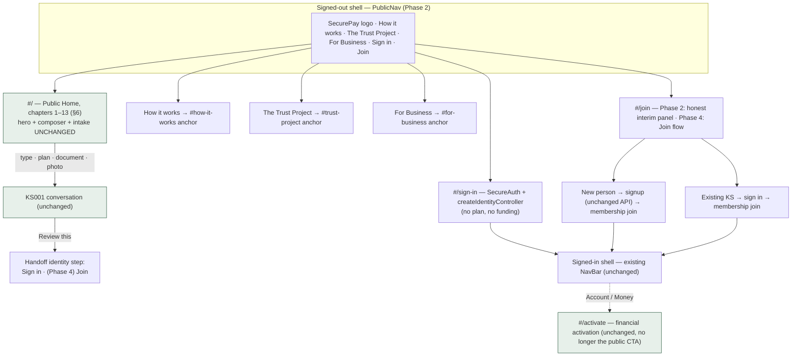
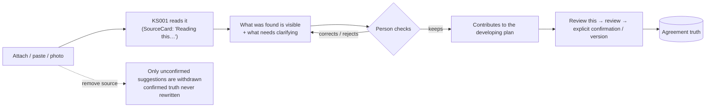
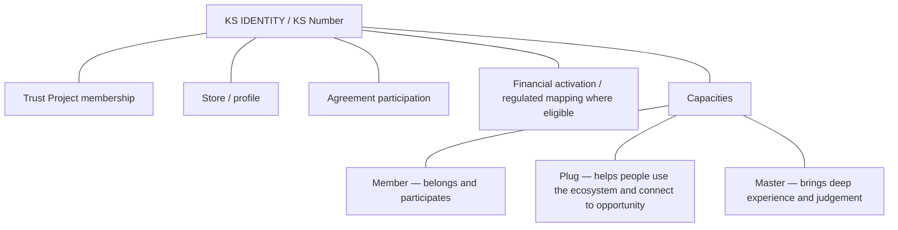
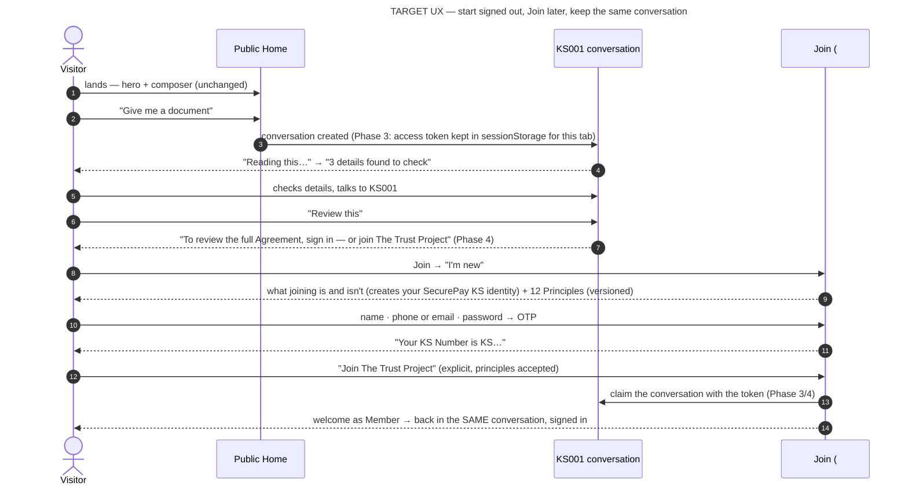
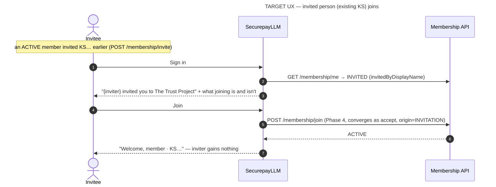

# Public Experience Convergence — Phase 1 — Product Contract and UI Archaeology

**Status:** Phase 1 documentation only. **Nothing here is implemented.** No component, route, style, copy or test was changed.
**Backend companions (SecurePayAPI, branch `docs/public-experience-convergence-phase1`):**
- `docs/architecture/PUBLIC_EXPERIENCE_CONVERGENCE_PHASE1_API_CONTRACT.md` — the **API contract**. It holds the signup, membership, continuity, source-matrix, Join-authority and identity-model diagrams.
- `docs/decisions/ADR-0021-PUBLIC-TRUST-PROJECT-JOIN-OVER-EXISTING-KS-IDENTITY.md`
- UR-203 … UR-215 in `docs/operations/UNRESOLVED_ITEMS_REGISTER.md`

**Labels:**

| Label | Meaning |
| --- | --- |
| **[Code fact]** | read at the baseline SHA; executable code wins over comments |
| **[Locked]** | locked product direction in the mandate |
| **[Decision]** | recommendation adopted by this contract |
| **[Future]** | a later phase must do this |
| **[Pending]** | needs a human decision (UR) |

**Diagram index (mandate §U):**

| # | Diagram | Where |
| --- | --- | --- |
| 1 | CURRENT signed-out architecture | §3 here |
| 2 | TARGET signed-out architecture | §4 here |
| 3 | CURRENT signup + membership sequence | API contract §7.1 |
| 4 | TARGET new-person Join | §13 here (UX) and API contract §7.1 (authority) |
| 5 | TARGET existing-KS Join | §14 here and API contract §7.1 |
| 6 | Anonymous conversation / source continuity (current and target) | API contract §5 |
| 7 | Identity / membership / capacity / authority model | §12 here and API contract §9 |
| 8 | Source trust pipeline | §7 here and API contract §6 |

---

## 1. Baseline SHAs

| Repository | Ref | SHA | Drift from mandate |
| --- | --- | --- | --- |
| SecurepayLLM | `main` | `2aecdf5b3be1280c5da39118f0d3596902435ff9` | none |
| SecurePayAPI | `main` | `2ab1681e33c5f02833e1c17b1dc863871f437317` | none |

This branch changes documentation only. The pre-existing, uncommitted local `vite.config.ts` dev-proxy edit is deliberately **not** part of it.

## 2. Executive finding

**The centre of the first screen is already right.** [Code fact]

`components/SignedOutHome.tsx` carries:
- the locked hero "Bring the plan. Leave with an agreement.";
- a real KS001 composer (`ConversationInput` → `controller.send`);
- three real intake modes — *Bring your plan* / *Give me a document* / *Show me* — that create the **same** conversation through `sourceController` and `ensureConversationId`;
- the Fair Trade affordance ("Guided by the 12 principles of fair trade ›");
- the honest trust line "Start without a KS Number. Nothing becomes an agreement until you review and confirm it."

It reveals value before asking for anything. That centre stays byte-identical: it is pinned by `tests/phase6-convergence.test.mjs` J/R1 and `tests/ui-phase7-trust-project.test.mjs`.

**Everything around the centre is wrong or missing.** [Code fact]

| # | Finding | Evidence | UR |
| --- | --- | --- | --- |
| 1 | The signed-out visitor sees the signed-in app's navigation. | `AgentExperience` renders `<NavBar view={showHome ? 'signed-out' : 'conversation'}>`, but `NavBar` has no signed-out variant. It shows Home, Agreements, Money, Store, Community, Account and 🔔 on desktop and on a fixed mobile bottom bar. | UR-213 |
| 2 | Most of those items dead-end. | `navigateTo` bounces signed-out people to Home with "Sign in through "Review this" to view your …". **"Review this" exists only inside a conversation**, never on Home. | UR-213 |
| 3 | There is no public *Sign in* and no *Join*. | The only Home CTA is "Activate SecurePay" → `#/activate` → `ActivationExperience`: sign-in **plus** plan choice **plus** activation funding. That is financial activation presented as the front door. | UR-213 |
| 4 | A new person cannot get a KS Number from Home. | `createSignupController` is mounted only in `RecipientExperience` (Agreement invitation `#/invitation/{token}`) and `SecureLinkExperience`. The "Review this" handoff identity step (`HandoffPanel`) offers sign-in only. | UR-213 |
| 5 | The Trust Project can be read about but not joined. | `TrustProjectSection` sits below Home. `CommunityExperience` tells non-members "The Trust Project is invitation-based…". The backend has no self-join (API contract §3). | UR-205 |
| 6 | Anonymous continuity is memory-only, and ownership proof is "knows the UUID". | There is no `localStorage` or `sessionStorage` anywhere in `src`. `AgentConversationAccessPolicy` + first-saver-wins (API contract §5). | UR-203 |
| 7 | Build-era vocabulary is visible. | "Read into BUILD", "Reading this into BUILD…", "N useful details added to BUILD", "Nothing from this reached BUILD yet", "backend" in five rendered strings (§10). | — |
| 8 | Contrast fails AA. | Secondary Home text uses `text-sand-500` on cream ≈ **3.05:1**. Inactive mobile nav labels use `text-sand-400` ≈ **2.07:1** at `0.6rem`. There is no reduced-motion guard. | §17 |
| 9 | Public identity oracle. | Public `GET /api/v1/stores/{ks}` returns display name, type and status for any ACTIVE KS, even one with no Store. | UR-215 |

**Programme order:**

| Phase | Scope |
| --- | --- |
| 2 | Public shell, copy and accessibility — UI only |
| 3 | Continuity token, rate limits and new sources — API + UI |
| 4 | Join over the existing KS identity — API + UI, needing ADR-0021 confirmation |

## 3. Current signed-out architecture

**Shared rendering.**
- `AgentExperience` also renders `SignedOutHome` for **signed-in** people, with `ContinueBuildingList` above it and a compact `TrustProjectSection`.
- The workspace Home is `WorkspaceExperience` → `SignedInHome`, whose `belowHome` slot holds the compact `TrustProjectSection`.
- Every public change must therefore branch on `sessionState.status`, never edit shared markup unconditionally (§8).

## 4. Target public architecture

**Invariants** [Locked]:
- The first screen belongs to SecurePay + KS001.
- The Trust Project neither swallows SecurePay nor hides behind it.
- Signed-out visitors never see Agreements, Money, Store, Community, Account or Notifications as navigation. Store and Community appear only as Home glimpses (§6 ch. 9).
- "Join" means **Join The Trust Project**, and it is transparent: "The Trust Project is powered by SecurePay. Your KS Number is your identity across both." Joining is never disguised account creation. The Join screen says plainly that it creates, or uses, your SecurePay KS identity. (Spelling of "KS Number": UR-214.)

## 5. Route and navigation map

| Route | Today | Target | Phase |
| --- | --- | --- | --- |
| `#/` default | `AgentExperience` Home | same; `PublicNav` when not signed in | 2 |
| `#/sign-in` | — (sign-in exists only inside `#/activate`, `HandoffPanel`, `SavedBuildPanel`, invitations, SecureLink, Referral) | new route: `createIdentityController` + `SecureAuth`. Afterwards it returns to the origin view (held in memory, never a URL-borne secret). It does no plan or funding step. | 2 |
| `#/join` | — | Phase 2: an honest panel — "Joining The Trust Project opens soon. You can already use SecurePay without joining." — plus Sign in. Phase 4: the full Join (§13–15). | 2 → 4 |
| `#how-it-works`, `#trust-project`, `#for-business` | — | in-page anchors on Home: scroll, then focus the chapter `<h2>`. They must not collide with the hash router: use `data-anchor` and `scrollIntoView`, and do not change `location.hash` for anchors. | 2 |
| `#/activate` | the public CTA target | unchanged behaviour; linked from the signed-in Account/Money only | 2 (entry only) |
| `#/invitation/{token}`, `#/my-invitations/{id}`, `#/invitations`, `/r…`, `#/money*`, `#/store/{ks}/offer/{id}` | existing | **unchanged** | — |

**PublicNav** (new, used only when `sessionState.status !== 'signed-in'`):

| Viewport | Layout |
| --- | --- |
| Desktop | Brand (mark + wordmark → `#/`) · How it works · The Trust Project · For Business · spacer · **Sign in** (`Button` secondary) · **Join** (`Button` primary). Sticky, `bg-cream-50/80 backdrop-blur-sm`, the same as today's bar. |
| Mobile | Top bar: brand · Sign in (text) · Join (primary, compact) · menu button (`aria-expanded`) that opens a top sheet with the three section links. **No bottom bar** when signed out, so the signed-out `pb-16` on the AgentExperience root is removed. |

The signed-in `NavBar` is unchanged.

## 6. Home information architecture and content contract

**Rules for every chapter** [Locked]:
- No fake named people, no fake live opportunities, no fake Store activity, no fabricated counts.
- Where there is no genuine public read, the chapter uses an honest static treatment.
- The fixture files (`src/demoData.ts`, `src/ecosystemData.ts`, `src/storeData.ts`, `src/circleData.ts`) are never imported by public components.
- Chapters 1–3 are the first screen. Chapters 4–13 sit **below** it.

### Ch. 1 — Public header

| Field | Contract |
| --- | --- |
| Purpose | orient; offer Sign in and Join |
| Question | "Where am I, and how do I get in?" |
| Copy | nav labels only (§5) |
| CTA | Sign in · Join |
| Live truth | session state only |
| Must not claim | anything about the visitor's account |
| Desktop | a single sticky row |
| Mobile | a compact bar + menu sheet |

### Ch. 2 — Hero

| Field | Contract |
| --- | --- |
| Purpose | the SecurePay + KS001 promise |
| Question | "What is this?" |
| Primary copy | "Bring the plan. Leave with an agreement." (**byte-identical**) |
| Secondary copy | the existing supporting paragraph (byte-identical) |
| CTA | the composer itself |
| Live truth | none |
| Must not claim | product names (SecureLink, SecureFlow, Funded Authority…) |
| Desktop | lockup `md:h-60`, `text-5xl` |
| Mobile | lockup `h-44`, `text-3xl` |

### Ch. 3 — Intake

| Field | Contract |
| --- | --- |
| Purpose | start immediately |
| Question | "Can I just tell it, or show it?" |
| Copy | composer placeholder "I need someone to tile my bathroom..."; intake row *Bring your plan · Give me a document · Show me*; trust line (byte-identical) |
| CTA | send / pick |
| Live truth | real conversation and source creation |
| Must not claim | that an attachment becomes the agreement; unsupported types (audio, links) |
| Desktop | inline row |
| Mobile | wrapping row; `capture="environment"` opens the camera |
| Phase 3 | the three links may become the one quiet "+" doorway (`AttachSourceMenu`) shared with the conversation, as long as the entry points keep working |

### Ch. 4 — Try asking (human possibilities as prompts)

| Field | Contract |
| --- | --- |
| Purpose | show the range of what people bring |
| Question | "Is this for someone like me?" |
| Copy | the mandate's eight prompts as chips: "I need someone to repair my roof." · "I have a quotation and I don't know if it makes sense." · "I need customers." · "I have experience I could teach." · "I need practical experience." · "I need someone who has done this before." · "I want to sell what I make." · "We are organising something together." |
| CTA | each chip calls the existing `onStart(prompt)` |
| Live truth | none |
| Must not claim | outcomes |
| Replaces | the current 7 prompts, including the named third party "…where Peter renovated my kitchen" |
| Desktop | wrapped chips, centred |
| Mobile | a horizontally scrollable single row with `snap-x`, no overflow of the page |

### Ch. 5 — How SecurePay works

| Field | Contract |
| --- | --- |
| Purpose | the mechanism, after the benefit |
| Question | "What actually happens?" |
| Primary copy | three steps: **Bring what you have** (say it, paste it, attach it) → **Make it clear together** (KS001 shows what it understood and what still needs deciding) → **Review, confirm, and let money follow** ("Nothing becomes an agreement until you review and confirm it. Money follows what was agreed.") |
| Secondary copy | "An attachment is never the agreement by itself — you check what KS001 found." |
| CTA | "Start with KS001" (scroll and focus the composer) |
| Live truth | none |
| Must not claim | guarantees, escrow or bank terms, regulated status |
| Desktop | 3 columns |
| Mobile | stacked, numbered |

### Ch. 6 — The Trust Project

| Field | Contract |
| --- | --- |
| Purpose | the human/community layer |
| Question | "What is The Trust Project, and how does it relate to SecurePay?" |
| Primary copy | "The Trust Project is powered by SecurePay. Your KS Number is your identity across both." |
| Secondary copy | the existing pillars (Technologies · Systems · People) and the origin story from `TrustProjectSection`, trimmed. Purpose through concrete possibilities, not a mission wall (§11). |
| CTA | Join · "Read the 12 Principles" |
| Live truth | none for signed-out visitors |
| Must not claim | member counts, "verified community", invitation-only (after ADR-0021) |
| Desktop | a text column with pillars as three quiet cards |
| Mobile | stacked, with the origin collapsed ("What The Trust Project is", the existing expander) |

### Ch. 7 — Member · Plug · Master

See §12.

| Field | Contract |
| --- | --- |
| Purpose | the capacities |
| Question | "Do I have to become something?" |
| Must not claim | ranks, income |
| Desktop | 3 equal cards |
| Mobile | 3 stacked cards, identical treatment |

### Ch. 8 — Real human possibilities

| Field | Contract |
| --- | --- |
| Purpose | the purpose of the Project made concrete |
| Question | "What could this do for people?" |
| Copy | six short, **unnamed** vignettes mapped to the purpose list: someone useful becomes easier to find; a fair deal becomes practical; practical knowledge passes to a younger person; a willing learner gets real practice; an opportunity reaches someone who can use it; people cooperate and stay independent |
| CTA | none, or "Start with KS001" |
| Live truth | none |
| Must not claim | that any vignette is a real case |
| Desktop | 2×3 quiet grid |
| Mobile | a single column |

### Ch. 9 — Store / Community glimpse

The safety analysis is in §6.1.

| Field | Contract |
| --- | --- |
| Purpose | show that people offer things and help each other |
| Question | "Can I find people, or offer something?" |
| Store | "People and businesses keep a Store for what they offer. Anyone can browse." |
| Community | "Members ask for and offer help in Community and Circles." |
| CTA | "Browse Stores" (opens the existing public Store search: user-initiated, real results, recency order, no ranking) · "Join to take part in Community" |
| Live truth | none rendered **on Home** |
| Must not claim | activity, counts, featured sellers |
| Desktop | 2 cards |
| Mobile | stacked |

### Ch. 10 — For Business

The mapping is in §6.2.

| Field | Contract |
| --- | --- |
| Purpose | the business doorway |
| Question | "Can my business use this?" |
| Primary copy | "Use SecurePay directly or build it into how your business already works." |
| Secondary copy | "A Business KS Number, a Store for your offers, and — once set up — tools to connect SecurePay to your own systems." |
| CTA | signed out: "Sign in to set up a Business" |
| Must not claim | API availability to the public, SLAs, pricing numbers not shown by the backend |
| Desktop | a text block plus 3 small feature lines |
| Mobile | stacked |

### Ch. 11 — Fair Trade

The contract is in §6.3.

| Field | Contract |
| --- | --- |
| Purpose | the trust basis |
| Question | "Why should I trust how this works?" |
| Copy | "Guided by the 12 Principles of Fair Trade" + "The principles guide how SecurePay and The Trust Project work. They are not a certification, a rating or a guarantee." |
| CTA | "Read the 12 Principles" → the existing `FairTradePrinciplesPanel` |
| Must not claim | that anyone is certified or scored |
| Desktop / mobile | a single centred line + button |

### Ch. 12 — Join The Trust Project

| Field | Contract |
| --- | --- |
| Purpose | the acquisition doorway |
| Question | "How do I join, and what does it cost me?" |
| Primary copy | "Join The Trust Project" |
| Secondary copy | "One KS Number for SecurePay and The Trust Project. You never have to invite, teach or sell. Joining doesn't turn on payments or fees." |
| CTA | **Join** · "I already have a KS Number" |
| Live truth | none |
| Must not claim | rewards, status |
| Desktop | a centred band on `bg-cream-50` with a soft `ks001-surface` light |
| Mobile | full-width buttons |

### Ch. 13 — Footer

| Field | Contract |
| --- | --- |
| Content | "Trouble signing in? Recover your account" (existing) · the 12 Principles · For Business · Sign in. Legal links **only if real pages exist**; otherwise omit them — never dead links. |
| Desktop / mobile | a simple 2-row block |

### 6.1 Store / Community public glimpse — what is safe today

| Question | Answer | Evidence |
| --- | --- | --- |
| Safe public Store search? | **Yes.** `GET /api/v1/stores/search?kind=PRODUCT\|SERVICE&category&location&limit≤10` returns published offers only, in recency order with no ranking. | `PublicStoreController#search` |
| Offers public? | **Yes**, published ones: `GET /api/v1/stores/{ks}/offers/{offerId}`; UI `#/store/{ks}/offer/{id}` | same |
| Identities publicly resolvable? | **Yes, too broadly.** `GET /api/v1/stores/{ks}` returns `displayName`, `identityType` and `status` for any ACTIVE identity, even without a Store. | UR-215 |
| Community content public? | **No.** The feed, composer and Circles require an ACTIVE membership. Signed-out visitors see "Sign in to see what the community is sharing." Only `GET /api/v1/community/principles` is public. | `CommunityExperience`, `requireActive` |
| Show real Store examples on Home? | **No** [Decision]. It would feature real people's offers without their consent to be promoted, and would read as endorsement. Offer browsing only on user action. | — |
| Show Community examples? | **No.** Not public, and must not be made public for Home. | — |

**Phase 2 plan:**
- Static explanatory cards.
- "Browse Stores" → `StoreExperience`'s existing public search.
- No new public reads, and no new holes through authentication.

### 6.2 For Business — what is real

| Capability | Real? | Where it belongs |
| --- | --- | --- |
| "For Business" plan (`BUSINESS`) with a Business KS identity | yes (`ActivationExperience` PlanCard: "subject to the authority and entitlement checks that apply") | named publicly in ch. 10; configured signed-in via `#/activate` |
| Business identity, members and roles (maker-checker) | partial (`BusinessExperience`: role assignment limited to the caller's own request) | signed-in Account → Business; **not** on the public Home |
| Store for Business offers | yes | ch. 9 / ch. 10 mention |
| Developer / Connect: app registration (SANDBOX/PRODUCTION), credentials, webhooks, SecureCode | yes, owned by the Business KS | named generically in ch. 10 ("tools to connect SecurePay to your own systems"); details only in signed-in Account → Developer / Connect |
| Must not clutter the consumer Home | API docs links, environment names, webhook or credential terms, pricing tables | — |

### 6.3 Fair Trade

- **Canonical text.** The source of truth is SecurePayAPI `services/agreement/src/main/resources/fair-trade/principles-v1.json`. The UI keeps a verbatim copy in `src/fairTradePrinciplesData.ts`, used by `FairTradePrinciplesPanel`. Community reads `GET /api/v1/community/principles`.
- **Stale comment.** The data file's comment ("There is currently no public REST endpoint") is out of date; the endpoint now exists. Phase 2 must **not** add a third copy. Phase 4 Join reads the versioned endpoint (API contract §15).
- **Affordance wording.** Keep "Guided by the 12 Principles of Fair Trade". Phase 2 capitalises "Principles" to match the panel title.
- **Fair Trade is not** a certification, rating, trust score, guarantee or endorsement. The panel already avoids scoring language.

## 7. Source intake capability matrix (UI view)

| Source | UI entry | API | Class | Truthful limits |
| --- | --- | --- | --- | --- |
| Type | `ConversationInput` → `controller.send` | turns | A | — |
| Paste a plan | Home "Bring your plan" / conversation "Paste a plan" → `BringPlanPanel` → `addPastedText` | `POST …/sources/pasted-text` | A | ≤ 200,000 chars |
| Document | "Give me a document" / "Document" → `addUpload('DOCUMENT')`; accept `.pdf,.docx,.txt,.md,.csv` | `POST …/sources/upload` | A | ≤ 15 MB; signature-validated |
| Spreadsheet (XLSX) | not offered | accepted and extracted by the backend | D | UR-211 |
| Photo | "Show me" / "Photo" → `addUpload('PHOTO')`; `image/jpeg,image/png` | upload | A | ≤ 10 MB, ≤ 40 MP; no WebP or HEIC |
| Camera | the same inputs with `capture="environment"` | = Photo | A | stills only |
| Voice / audio | — | — | E | Phase 3 design (API contract §13) |
| Web / link | — | no fetcher | E (F if fetched naively) | Phase 3: declared text only; SSRF ADR before any fetch |
| Location | the WHERE instrument (typed place) | `structured-inputs` (lat/long accepted, never sent) | B | typed place only; never inferred |
| Store item | "Use this" / Find on SecurePay | `…/commercial-source` | A | snapshot-bound |
| Previous Agreement terms | Agent tool path | `…/prior-agreement-terms` | B | authenticated, own Agreements |
| Previous conversation | Continue Building → resume | saved build | B | resumes, doesn't import |
| Community post | — | — | E | membership-scoped; out of scope |

**Behaviour** [Code fact]:
- The first source creates the conversation (`ensureConversationId`). Document and Photo leave Home immediately; Paste opens `BringPlanPanel` on Home.
- Retry reuses the same source. Remove retires only unadopted candidates.
- Errors distinguish: unsupported type · too large · not found · "received but couldn't read it right now — nothing has been added". Under `SECUREPAY_AGENT_MODEL_PROVIDER=none` a source is received but not understood (UR-212), and the copy must stay truthful.

**Source trust pipeline** (the UI's obligations at each step; full diagram in API contract §6):

**UI rules:**
- A file is not proof.
- A photo is not proof of fact.
- A website is not authoritative.
- AI-extracted text is not confirmed.
- Cards say "found to check", never "added to your agreement".

## 8. Affected-component map

**The rule:** if a shared component changes for the public journey and visibly affects a signed-in page, the impact is listed here before Phase 2 starts.

| Component | Class | Change / reason | Signed-in impact |
| --- | --- | --- | --- |
| `components/NavBar.tsx` | **A** | signed-out branch or a new `PublicNav` (desktop + mobile) | none if the branch is on session state; the signed-in items are unchanged |
| `features/agent/AgentExperience.tsx` (public branch, `navigateTo` notices, root `pb-16`) | **A** | shell selection, dead-end notices → Sign in, Join/Sign-in wiring | the notices only fire when signed out; the `ContinueBuildingList` branch is untouched |
| `components/SignedOutHome.tsx` | **A** | "Activate SecurePay" CTA → Sign in / Join (signed out only); new prompt set; chapters 4–13 below the hero | **Yes: it is rendered for signed-in people too.** New chapters render only when signed out. The hero, intake, Fair Trade and trust line stay byte-identical. |
| `components/TrustProjectSection.tsx` | **A** | Member/Plug/Master copy (§12); the "powered by SecurePay" line | **Yes: the compact variant shows on the signed-in Homes** (`AgentExperience`, `SignedInHome` `belowHome`). The copy change is intended for both; layout stays. |
| `features/sources/ui/BringPlanPanel.tsx`, `SourceCard.tsx` (+ `SourcesList`) | **A** | BUILD vocabulary (§10) | **Yes: used in signed-in conversations too.** An intended copy-only change. |
| `features/sources/controller.ts` (error text) | **A** | "…added to your agreement…" → "…to this conversation…" | both; copy only |
| `features/community/CommunityExperience.tsx` (non-member copy) | **A (Phase 4 only)** | "invitation-based" → Join, after ADR-0021 is confirmed | signed-in non-members |
| `RuntimeApp.tsx` | **A** | `#/sign-in`, `#/join` hooks, added **before** the default | none |
| `features/sources/ui/AttachSourceMenu.tsx` | **D** | Phase 3 may add kinds; Phase 2 doesn't touch it | the conversation composer |
| `components/ConversationInput.tsx` | **C** | unchanged (the placeholder is passed by the caller) | — |
| `components/FairTradePrinciples.tsx` (`FairTradeAffordance`, `FairTradePrinciplesPanel`) | **B** | capitalisation "Principles"; colour `sand-500` → `sand-600` for AA | **Yes:** the affordance also shows on `SignedInHome`; an intended AA fix |
| `components/dna/Surface.tsx`, `Button.tsx`, `PageHeader.tsx`, `StatusNotice.tsx` | **B** | only *additive* variants (e.g. `Surface tone="quiet"`, `Button size="sm"`); no default changes | none if additive — defaults are used across every signed-in page |
| `components/SecureAuth.tsx` | **B** | reused for `#/sign-in`; maybe a `heading` prop | none if additive (used by handoff, activation, recipient, SecureLink) |
| `features/identity/controller.ts` | **C** | reused as is | — |
| `features/signup/controller.ts` | **B** | `signupErrorText` gets a caller-supplied context sentence; still one generic 4xx message | recipient + SecureLink must keep their current wording (a default parameter) |
| `features/recipient/*`, `features/securelink/*`, `features/handoff/*` (authority flow), `features/activation/*`, `features/money/*`, `features/review/*`, `features/amendments/*`, `features/execution/*`, `features/workspace/*`, `SignedInHome.tsx` | **C** | authority or pinned behaviour | — |
| `features/store/*`, `components/StoreHome.tsx` | **C** / **D** | the public search is reused as is; styling reviewed later | — |
| Fixture App: `App.tsx`, `demoData.ts`, `ecosystemData.ts`, `storeData.ts`, `ReferralHistoryView.tsx`, `DisputeMaster*.tsx`, `AgreementBuilderView.tsx` | **C** | must never feed public UI | — |
| `features/plug/*`, `features/master/*`, `features/referral/*`, `features/business/*`, `features/developer/*`, `features/invitation-inbox/*` | **D** | public framing depends on UR-207/208; copy leaks in §10 | — |
| `tailwind.config.js`, `src/index.css` | **B** | optional *new* tokens only (e.g. a `public-chapter` background); existing tokens unchanged; a reduced-motion rule in CSS | the reduced-motion rule affects every page (intended) |

## 9. Visual convergence specification

### Archaeology [Code fact]

| Area | What exists |
| --- | --- |
| Colour | `cream` 50–500 (`#fdfcf8` … `#cdbf99`), `forest` 50–900 (`#f0f7f3` … `#162d21`), `ember` 50–900, `sand` 50–900 (`tailwind.config.js`) |
| Shadows | `soft`, `card`, `lifted`, `inset-soft`, `deliberate` — all forest-tinted, low alpha |
| Gradients | `bg-ks001-surface`: two low-alpha forest radial lights, used only on the active conversation |
| Type | Fraunces (`font-display`, 300–700, optical sizes) for headings; Inter for body — Google Fonts in `src/index.css` |
| Radii | `rounded-xl` (buttons, notices), `rounded-2xl` (Surface, menus), `rounded-full` (chips) |
| Motion | `animate-fade-in-up` / `-down` with staggered `animationDelay`; `animate-pulse-soft` (KS001 thinking) |
| Primitives | `dna/Surface` (+`SurfaceBody`): white, cream-200 border, `shadow-card`. `dna/Button`: primary forest-700 / secondary outline. `PageHeader`, `StatusNotice` (tones), `MoneyValue`. |
| Patterns | `FairTradePrinciplesPanel` is the one modal/sheet (`role="dialog"`). `AttachSourceMenu` is a popover (`shadow-lifted`). |
| Icons | `lucide-react`, 16–18 px, sand-500 |
| Brand | `assets/brand/securepay/`: `securepay-lockup-by-keyman.png`, `securepay-mark-green.png`, `securepay-wordmark-horizontal.png`, plus references (`SHA256SUMS.txt`) |
| Prior spec | `docs/PHASE1_VISUAL_DNA.md` |

**Why it feels flat.** Nearly every surface is cream page → white bordered `Surface` → another white bordered `Surface`:
- the same radius, border and shadow everywhere;
- no chapter-level background change;
- no elevation hierarchy between "section" and "card";
- small low-contrast secondary text (`sand-500`);
- display type used only in headings of one size.

### Specification (implementable with existing tokens)

| Topic | Rule |
| --- | --- |
| Page background system | Base `bg-cream-100`. Chapters alternate **cream-100** and **cream-50**. The first-screen hero and the Join chapter carry a soft light (`bg-ks001-surface`, or a new equally subtle `public-hero` radial token in forest at ≤ 0.09 alpha). |
| Section backgrounds and transitions | Chapters are separated by a **curved soft edge** (an SVG wave or `rounded-t-[2.5rem]` on the next chapter's container, overlapping by 2.5 rem), not by hairlines everywhere. At most two curved transitions on the page. |
| Card hierarchy | Level 0 = chapter (no border). Level 1 = `Surface` with `shadow-soft` (not `card`) for explanatory cards. Level 2 = the interactive card (Join, sign-in) with `shadow-lifted`. Never nest a bordered card in a bordered card. |
| Elevation | soft (explanatory) < card (lists) < lifted (auth/join, menus) < deliberate (the primary composer focus) |
| Hero composition | Unchanged: centred lockup → h1 → supporting text → composer → intake row → Fair Trade → trust line. Prompts move to ch. 4 **directly below the fold line**, keeping the same chips. |
| Typography | h1 `font-display text-3xl md:text-5xl text-forest-800` (existing). Chapter h2 `font-display text-2xl md:text-4xl text-forest-800 tracking-tight`. Card title `font-display text-lg`. Body `text-[0.95rem] leading-relaxed text-sand-700`. Secondary text `text-sand-600` minimum. Eyebrow `text-[0.7rem] uppercase tracking-wide text-forest-600`. |
| Interactive states | Hover: `bg-forest-50` / `text-forest-800`. Focus: `focus-visible:ring-2 ring-forest-300 ring-offset-2 ring-offset-cream-50`. Pressed: `active:scale-[0.99]`. Disabled: `opacity-40` + `cursor-not-allowed`. Busy: text changes ("Reading…") and never a spinner alone. |
| Source cards | Keep the structure. Status line in `sand-700`. "N details found to check" in `forest-700`. Uncertainty in `ember-700` (5.38:1). |
| Auth and Join cards | One `Surface` at `shadow-lifted`, `max-w-md`, a `font-display` heading, a two-sentence explanation of what this does and does not do above the form, then the fields. Errors via `StatusNotice tone="error"` with `role="alert"`. |
| Trust Project section | Text-led, with pillars as three level-1 cards. Member/Plug/Master as three **identical** cards (the same size, icon weight and colour; no ember accent on any one). The SecurePay mark is used once, small, as a motif. |
| Store / Community glimpses | Two level-1 cards with a lucide icon, two lines of copy and a secondary button. No product imagery (no real public items are shown on Home). |
| Mobile | A single column, 16 px gutters (`px-4`), no horizontal page scroll (prompts scroll inside their own row). Top-sheet menu. Buttons full width in ch. 12. Tap targets ≥ 44 px. |
| Motion | Keep fade-in-up for chapter entry, triggered once. Add `motion-reduce:animate-none` / `motion-reduce:transition-none` globally for public chapters. No parallax, no autoplay. |
| Empty states | Public Home has none. A failed Store search says "SecurePay couldn't search Stores right now — try again". An empty result says "No Stores match that yet". Never placeholder cards. |
| Accessibility and contrast | §17 |
| Anti-patterns (forbidden) | corporate blue, multicolour, glassmorphism beyond the existing nav blur, stacked bordered cards, decorative stock photos, fake avatars or faces, counters, trust badges or seals, "verified" ticks, carousels of testimonials, dark patterns on Join (pre-ticked boxes, "No thanks, I don't want fair trade") |

## 10. Customer-language cleanup register

**Method.**
- `rg` over `src` (excluding tests), for the terms in the mandate: BUILD, Phase, Slice, Upgrade, Section, source artifact, candidate, backend, frontend, mock, fixture, demo, placeholder, temporary, not implemented, not available, not open, coming soon, development, unsupported, provider and model names, technical ids.
- Hits in comments, types, class names and non-rendered identifiers were discarded as **category 1**: there were hundreds (e.g. "KS001 Upgrade Phase 3…" comments), all internal.
- No rendered hits were found for Phase, Slice, Upgrade, Section, source artifact, candidate fact, mock, fixture, "coming soon", or provider or model names (Anthropic, Claude, GPT).

**Categories:**

| # | Category | Rendered rows |
| --- | --- | --- |
| 1 | internal only | not listed |
| 2 | valid | 4 |
| 3 | BUILD or build scaffold | 9 |
| 4 | required limitation, rewrite | 9 |
| 5 | fixture leak risk | 1 group |

| # | File | Component | Exact rendered phrase | Cat. | Why | Direction | Phase |
| --- | --- | --- | --- | --- | --- | --- | --- |
| 1 | `features/sources/ui/BringPlanPanel.tsx` | button | "Read into BUILD" | 3 | internal workspace name | "Add to this conversation" | 2 |
| 2 | `features/sources/ui/BringPlanPanel.tsx` | helper | "SecurePay will read the useful parts into BUILD as suggestions." | 3 | same | "SecurePay will pick out useful details as suggestions for you to check." | 2 |
| 3 | `features/sources/ui/SourceCard.tsx` | status | "Reading this into BUILD…" | 3 | same | "Reading this…" | 2 |
| 4 | `features/sources/ui/SourceCard.tsx` | summary | "N useful detail(s) added to BUILD" | 3 | same; also over-claims (these are suggestions) | "N detail(s) found to check" | 2 |
| 5 | `features/sources/ui/SourceCard.tsx` | summary | "Nothing from this reached BUILD yet" | 3 | same | "Nothing useful found in this yet" | 2 |
| 6 | `features/money/MoneyExperience.tsx` | SectionCard | "The backend derives your identity and KSNumber — you only tell it about the account you want paid into." | 3 | engineering term | "SecurePay already knows who you are — just tell it where you want to be paid." | 2 |
| 7 | `features/developer/DeveloperExperience.tsx` | PageHeader | "…Only real, backend-verified capability is shown here." | 3 | engineering term | "…Only what's available to your Business is shown here." | 2 |
| 8 | `features/business/BusinessExperience.tsx` | Role management | "SecurePay's backend has real maker-checker role-assignment authority… The current participant-facing contract does not yet support…" | 3 | build/contract language | "Assigning roles to other members isn't available here yet. You can request a role for yourself." | 2 |
| 9 | `features/activation/ActivationExperience.tsx` | fallback | "This application does not recognize the backend's reported next action and will not guess…" | 3 | engineering | "SecurePay has a next step this screen can't show yet. Check again, or contact support." | 2 |
| 10 | `features/agent/AgentExperience.tsx` | `navigateTo` notices | 'Sign in through "Review this" to view your Projects / Vision Board / account / notifications / agreements.' | 4 | a dead end on Home | "Sign in to see your …" + Sign in button | 2 |
| 11 | `components/SignedOutHome.tsx` | CTA block | "Ready to use SecurePay for your own agreements?" / "Activate SecurePay" | 4 | financial activation as the front door | Sign in · Join; activation stays in Account/Money | 2 |
| 12 | `components/SignedOutHome.tsx` | prompts | "Show me the agreement where Peter renovated my kitchen" | 4 | a named third party on the public Home | replaced by the ch. 4 prompt set | 2 |
| 13 | `features/signup/controller.ts` | `signupErrorText` | "That didn't work. Nothing has been joined. Your invitation is still available if it hasn't expired." / "…Your invitation is still available." | 4 | invitation-specific; wrong on public Join | a caller-supplied context sentence; keep one generic 4xx message; add "Already have a KS Number? Sign in" on Join (UR-209) | 2 / 4 |
| 14 | `features/community/CommunityExperience.tsx` | non-member | "The Trust Project is invitation-based. You'll see Community posts once someone already here invites you." | 4 | superseded by ADR-0021 once confirmed | "Join The Trust Project to see and share in Community." | 4 |
| 15 | `components/TrustProjectSection.tsx` | Plug card | "Connect useful people, needs and opportunities. … When a real commercial introduction qualifies under SecurePay's existing referral rules, part of the value it created can be shared. Inviting someone to join is not an introduction and earns nothing." | 4 | narrower than the locked Plug definition (practical help, paid work); leads with referral value | §12 copy | 2 |
| 16 | `features/sources/controller.ts` | error | "SecurePay received this, but couldn't read it right now. Nothing from it has been added to your agreement yet." | 4 | nothing is an agreement yet | "…Nothing from it has been added yet." | 2 |
| 17 | `components/NavBar.tsx` | nav | Agreements / Money / Account / Notifications for signed-out visitors | 4 | public nav leak | `PublicNav` | 2 |
| 18 | `components/OfferBuilderView.tsx` | placeholder | "Media reference (URL or asset id)" | 4 | technical id | "Photo link" (review with Store media) | D |
| 19 | `components/SignedOutHome.tsx` | trust line | "Start without a KS Number. Nothing becomes an agreement until you review and confirm it." | 2 | true and locked | keep (pinned) | — |
| 20 | `components/TrustProjectSection.tsx` | Learn | "…The Skills Institute, for structured training and practice, is not open yet." | 2 | a truthful limitation | keep | — |
| 21 | `features/instruments/controller.ts` | status | "SecurePay can't check KS Numbers right now." | 2 | truthful | keep | — |
| 22 | `components/FairTradePrinciples.tsx` | affordance | "Guided by the 12 principles of fair trade ›" | 2 | valid | capitalise; `sand-600` | 2 |
| 23 | `App.tsx` `#/demo/*`, `demoData.ts` ("Peter needs to confirm Demo v2"), `ecosystemData.ts` ("KEBS accredited (demo)" …), `storeData.ts`, `circleData.ts`, `CircleDiscoveryList.tsx`, `ReferralHistoryView.tsx`, `DisputeMaster*` | fixture App | multiple | 5 | Fixture-only: `FixtureApp` loads only when `import.meta.env.DEV && VITE_SECUREPAY_MODE=fixture`, and `config/securepay.ts` throws on fixture mode in production. The risk is **reuse** as "preview" content, plus the Master-as-dispute-judge framing. | a Phase 2 test that public components import none of them | 2 (test) |

**Mobile tabs "Build" / "Understood"** (`AgentExperience`) are product vocabulary, not scaffolding. Keep them. Revisit only if the BUILD concept is renamed product-wide ([Pending], not raised as a UR: the product owns the name).

## 11. Trust Project content contract

**Purpose, as concrete possibilities** [Locked]:
- useful people become easier to find;
- fair trade becomes practical;
- practical knowledge moves between generations;
- willing learners develop real capability;
- opportunity reaches people who can use it;
- people cooperate without surrendering their independence.

These appear as the ch. 8 vignettes, not as a slogan list.

**Must say:**
- "The Trust Project is powered by SecurePay. Your KS Number is your identity across both."
- There is one KS Number and no Trust Project number.
- Joining creates or uses your SecurePay KS identity (transparent, not disguised).
- You never have to invite, teach or sell. A quiet member is a complete member (existing copy).
- Belonging is not a certificate that someone is trustworthy (existing copy).
- You can use SecurePay without joining.
- Joining doesn't turn on payments, fees, bank or regulated accounts, or settlement, and does no KYC beyond the contact check at signup.
- The Skills Institute is not open yet.

**Must not say:**
- counts, growth, leaderboards, testimonials;
- "verified members";
- tiers, levels or "upgrade to Plug/Master";
- income tied to joining or inviting;
- "invitation-only" (after ADR-0021 is confirmed).

**CTAs:**

| Visitor | CTAs |
| --- | --- |
| Signed out | Join · Read the 12 Principles · Browse Stores |
| Signed-in member | Explore Community |
| Signed-in non-member | Join (Phase 4) |

## 12. Member / Plug / Master contract

Three capacities of one KS identity, **side by side**. Member is the centre; none of them is an identity; nothing is "above" Member.

| | Member | Plug | Master |
| --- | --- | --- | --- |
| Card line | "Belong and take part." | "Help people use the ecosystem and reach opportunity." | "Bring deep practical experience." |
| Card detail | "Ask, help, learn, offer work, use Community, keep a Store where eligible, discover opportunities, make Agreements, find a Plug or a Master, share what you know. A quiet member is a complete member — you never need to become anything else." | "A practical guide who understands The Trust Project and its tools, and can help someone get started, set up a profile or Store, photograph and list products, find people, resources, Masters and opportunities, and understand SecurePay — in person or online. Plugs may also do separately agreed paid work. Income is never guaranteed, inviting people earns nothing, and a Plug can only manage what someone has explicitly delegated." | "Someone with real, demonstrable experience in a field, who can offer consultation, a Master Opinion or second opinion, teaching, mentoring, practical sessions, apprenticeship and project supervision, or real professional work. Paid help is agreed separately. A Master is not a judge: being a Master never decides Agreements, disputes or releases money." |
| Is not | a lowest tier; recruitment duty; required to become Plug or Master | a recruiter; an Agreement or money authority; a guaranteed income | a judge; an Agreement authority; Payment Ready or release authority; a trust score |
| Backend truth | an ACTIVE membership row | market-network Plug participation (Market Ready → explicit entry). A separate Agreement Plug Lifetime Share exists **only** through explicit Agreement attribution and is a backend entitlement, not a promise (UR-208). | a Master profile by **self-designation** (`/master/me/designate`, unverified). Do not say "verified" or "certified" (UR-207). |
| Public CTA | Join | none on the public Home (existing flows are signed-in) | none on the public Home until UR-207 is resolved |

Skills Institute: "not open yet" (keep).

## 13. Signed-out → conversation → Join UX sequence

**Rules:**
- Each step can stop safely. A KS identity without membership is a complete, valid state. The UI offers "Finish joining The Trust Project" when a signed-in person is not a member and came from Join.
- Continuity must survive signup. It is in-page (SPA) today and tab-scoped with the Phase 3 token. The conversation is claimed only with the token (API contract §5).
- **Phase 2 adds no persistence of `conversationId`**, and nothing ever puts it in `localStorage` or in URLs.
- Must be tested later:
  - claim with the wrong token → not found;
  - reload in the same tab resumes;
  - a new tab has no access;
  - sources are still attached after the claim;
  - no Agreement is created by Join.

## 14. Existing-KS Join sequence

1. Join → "I already have a KS Number" → KS Number + password → OTP (`createIdentityController` + `SecureAuth`).
2. Read `GET /community/membership/me`. The result decides the screen:

   | State | Screen |
   | --- | --- |
   | ACTIVE | "You're already a member · KS…". No write. |
   | INVITED | "{inviter} invited you to The Trust Project." Join (= accept). |
   | none | Join |
   | DECLINED | Join, per UR-206 |
   | REVOKED | "Joining isn't available for this KS Number. Contact support if you think this is a mistake." No reason text. |

3. **A signed-in person is never offered signup.** There is no second identity.
4. **The "I'm new" path by someone who already has a KS Number.** Signup sends an OTP and then fails generically (anti-enumeration, UR-209). The Join error panel must then offer "Already have a KS Number? Sign in" and "Recover your account", and must never say "this contact is registered".

The authority sequence is in API contract §7.1 ("TARGET — existing KS holder Joins").

## 15. Invited-person sequence

The two invitation kinds must never be blurred.

| Invitation | Arrives via | Today | Target |
| --- | --- | --- | --- |
| **Agreement invitation** | link `#/invitation/{token}` | `RecipientExperience`: sign-in or signup (KS issued), then an explicit Agreement join | unchanged (class C). Afterwards a quiet "You can also join The Trust Project" link. There is never an auto-join. |
| **Trust Project invitation** | an ACTIVE member invites an **existing** KS Number (no link) | the invitee sees it in Community → accept or decline | After sign-in, Home and `#/join` show "{inviter} invited you". Join = accept, and the invitation provenance is kept. The inviter gets no ownership, hierarchy or referral reward. One KS Number, one membership. A person with no KS Number cannot be invited today (UR-210). |

## 16. Desktop and mobile

| Aspect | Desktop (≥ md) | Mobile (< md) |
| --- | --- | --- |
| Nav | sticky top bar: brand, 3 links, Sign in, Join | top bar: brand, Sign in, Join, menu sheet. **No bottom bar** when signed out. |
| Hero | lockup `md:h-60`, `text-5xl` | lockup `h-44`, `text-3xl`; composer full width |
| Intake | an inline link row | a wrapping row; the camera opens via `capture` |
| Prompts | wrapped chips | one scrollable row inside its own container |
| Chapters | 2–3 columns | a single column, same order |
| Join / Sign-in | a centred `max-w-md` card, the explanation above | full-width card; OTP `inputmode="numeric"` `autocomplete="one-time-code"` |
| Verification widths | 1440, 1280, 1024, 768 | 390, 360, 320. The `resize_window` floor is ≈606 px, so use the same-document iframe technique for mobile. |

## 17. Accessibility

**Findings** [Code fact]:

| Where | Measured / observed | Status |
| --- | --- | --- |
| Fair Trade affordance, trust line, "Ready to use…", nav notices | `text-sand-500` on cream-100 = **3.05:1** at 0.75–0.8 rem | fails AA 4.5:1 |
| Inactive mobile nav labels | `text-sand-400` = **2.07:1** at 0.6 rem | fails |
| `animate-fade-in-*` | no `prefers-reduced-motion` handling | — |
| Hidden file inputs | triggered by buttons (OK) | the button names don't say a file picker opens |
| `sand-600` | 4.53:1 | passes |
| `sand-700` | 6.52:1 | passes |
| `forest-700` | 9.43:1 | passes |
| `ember-700` | 5.38:1 | passes |

**Phase 2 requirements (WCAG 2.2 AA):**
- Secondary text ≥ `sand-600`.
- `motion-reduce:` guards.
- One `<h1>` (the hero). Chapter `<h2 id>` for the anchors, and focus moves to the heading.
- A "Skip to KS001" link.
- Menu button with `aria-expanded` + `aria-controls`; the sheet traps focus and closes on Esc.
- Join and sign-in forms: real `<label>`s, `aria-describedby` errors, `role="alert"`, OTP autocomplete, password visibility toggle.
- Visible focus rings. Targets ≥ 44 px (2.5.8). No reliance on colour alone.
- Prompt chips are `<button>`s with the full text.
- Language: `index.html` already sets `lang="en"` (keep it).

## 18. Phase 2 UI plan (UI only — no API changes)

1. **PublicNav** (desktop + mobile sheet), selected when not signed in. Remove the signed-out `pb-16`.
   - Test: the signed-out shell renders none of Agreements, Money, Store, Community, Account or Notifications.
   - Test: the signed-in NavBar is unchanged.
2. **`#/sign-in`** (`createIdentityController` + `SecureAuth`), returning to the origin. Replace the §10 #10 notices with a Sign in action.
   - Test: `#/sign-in` never calls the subscription or activation gateways.
3. **`#/join` interim panel.** Honest, no signup yet. Signup lives on Join only from Phase 4, once ADR-0021 is confirmed.
4. **Home chapters 4–13**, rendered only when signed out, below the unchanged hero.
   - Replace the CTA and the prompts.
   - Tests: the hero, supporting text and trust line are byte-identical; the principles come from `FAIR_TRADE_PRINCIPLES` (no new list); no public component imports fixture modules; no digits-followed-by-"members/people/stores" patterns on Home.
5. **Copy register** rows marked Phase 2 (§10: 1–13, 15–17, 22). Update the tests that pin old strings.
6. **Accessibility** (§17) on public surfaces, plus the shared `FairTradeAffordance` colour.
7. **Browser verification** against the real backend at the §16 widths, signed out and signed in (no regressions on `SignedInHome` / `WorkspaceExperience`).

**Phase 3** (API + UI):
- the conversation access token and claim-with-token;
- anonymous rate limits;
- XLSX offer;
- AUDIO / LINK (declared) / PLACE — API contract §13.

**Phase 4** (API + UI):
- `POST /community/membership/join` and the versioned principles;
- Join flows §13–15;
- the Community copy (§10 #14);
- the signup error context (#13).

## 19. Non-goals

**Phase 1 changed none of the following** (verified by `git diff`):
- no rebuilt `SignedOutHome` and no navigation change;
- no Join endpoints, and no change to membership transitions or signup;
- no new AUDIO/LINK/LOCATION sources;
- no change to anonymous ownership or ingestion;
- no change to Store or Community access, financial activation or Agreement authority;
- no fake preview data, no restyling, and no removal of BUILD wording.

**Never, in any phase, without a new decision:**
- a Trust Project number or a second identity;
- ranks or tiers;
- membership-gated SecurePay usage;
- membership → financial activation;
- invitation → referral reward;
- public member counts or directories;
- real people's Store items featured on Home;
- continuity via a bare `conversationId` in `localStorage` or in URLs;
- new public identity reads.
